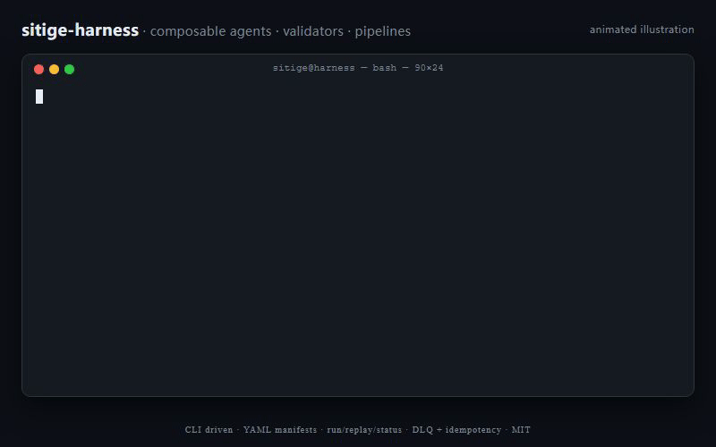

# sitige-harness

> Pipeline engineering harness — composable agents / validators / pipelines runtime, CLI-driven, observable.
> Extracted from a production e-sports business automation system.

[](LICENSE)


> 🌏 [中文 README](README.zh-CN.md)



## What this is

A three-layer harness for building reliable business pipelines:

```
agents/      ← LLM-backed actions (compliance review, content drafting, recruiting outreach…)
validators/  ← Pure-function gates (secret scan, pricing rules, schema check…)
pipelines/   ← Orchestrate stages, with retries / DLQ / idempotency / observability
```

A pipeline is declared in a YAML manifest — it lists stages, their validators, and timeouts. The CLI runs it, persists artifacts, and exposes `/status`, `/runs`, `/manifest` over FastAPI.

## Why

Business automation projects collapse because each script grows its own retry / log / config / metrics tangle. This harness gives you those for free, so the only code you write is the actual *agent* or *validator*.

## Features

- **CLI-driven** — `sitige run <pipeline>`, `sitige status`, `sitige replay <run>`.
- **Async-native** — pipelines, agents, validators all `async`.
- **Observability** — Prometheus metrics, OpenTelemetry traces, health probes, alerter (DingTalk / WeCom).
- **Scheduling** — APScheduler-backed jobs, idempotency keys, dead-letter queue.
- **Storage abstraction** — SQLAlchemy + Alembic migrations, Redis cache, pluggable artifact store (local / Qiniu / Aliyun OSS / Tencent COS).
- **Quality gates** — pyproject ships ruff + mypy + bandit + pytest config; coverage floor.
- **HTTP API** — FastAPI server exposes pipelines, runs, manifests over WebSocket + REST.

## Quick start

```bash
git clone https://github.com/lfzds4399-cpu/sitige-harness.git
cd sitige-harness
pip install -e ".[dev,api,observability,scheduling,storage]"

cp .env.example .env
# fill in at minimum DEEPSEEK_API_KEY (or another LLM provider)

sitige --help
sitige run content --dry-run
```

## Pipelines included

The reference pipelines come from the original e-sports use case:

| Pipeline | What it does |
|---|---|
| `content`    | Topic selection → script → AIGC prompts → compliance review → publish brief |
| `compliance` | LLM-driven content compliance audit (allow / warn / block) |
| `recruit`    | Channel scan → outreach → KYC → deposit → contract |
| `crm`        | Customer lifecycle stages with retention probes |
| `match`      | Service matching scoring + ranking |

Each pipeline lives in `src/tetra_harness/pipelines/` and ships with a YAML manifest in `configs/`. Use them as-is, fork them, or write your own — the framework doesn't care what business you're in.

## Project layout

```
src/tetra_harness/
├── agents/         # LLM-backed actions
├── validators/     # Deterministic gates
├── pipelines/      # Stage orchestration
├── api/            # FastAPI server (REST + WebSocket)
├── scheduling/     # APScheduler + DLQ + idempotency
├── observability/  # Metrics, tracing, health, alerter
├── storage/        # DB, cache, artifacts, secrets
├── manifest.py     # YAML-driven pipeline declaration
├── cli.py          # `sitige` entry point
└── config.py       # Env-aware settings

alembic/            # DB migrations
configs/            # Pipeline YAML manifests
docs/               # API / OBSERVABILITY / PIPELINES / SCHEDULING / STORAGE
tests/              # pytest suite (api / pipelines / storage / quality)
```

## Documentation

- [Pipelines](docs/PIPELINES.md) — how stages, agents, validators compose
- [API](docs/API.md) — FastAPI surface
- [Observability](docs/OBSERVABILITY.md) — metrics, traces, alerts
- [Scheduling](docs/SCHEDULING.md) — APScheduler, idempotency, DLQ
- [Storage](docs/STORAGE.md) — DB / cache / artifact

## Status

**Beta.** The harness has been running a real production pipeline for months — but the public API surface (CLI flags, manifest schema) may still shift before 1.0. Pin the minor version if you build on top of it.

The repo doubles as a **reference implementation** of the three-layer pattern (`agents/` + `validators/` + `pipelines/`) the author uses across several internal harnesses — `sitige cli.py self-test` runs the same self-audit (validators present, subprocess captured, quiet logging available, manifest persisted, etc.) against any project that follows the layout.

## Contributing

PRs welcome. See [CONTRIBUTING.md](CONTRIBUTING.md). For security issues, see [SECURITY.md](SECURITY.md).

## Sibling projects

Other small, single-author harnesses I publish under [@lfzds4399-cpu](https://github.com/lfzds4399-cpu) — same MIT, same opinionated taste:

| Repo | One line |
|---|---|
| [**ai-council**](https://github.com/lfzds4399-cpu/ai-council) | Multi-voter consensus framework — drop into any pipeline as a validator that requires Claude *and* DeepSeek to agree |
| [**domain-harness**](https://github.com/lfzds4399-cpu/domain-harness) | Real-world consumer of this three-layer pattern: domain-investing pipeline with hard budget walls |
| [**voice2ai**](https://github.com/lfzds4399-cpu/voice2ai) | Hands-free dictation for Windows — push-to-talk, 4 STT providers, 10+ chat apps |

If sitige-harness is useful, ⭐ the repo — it's the cheapest signal and it actually moves the needle.

## License

MIT — see [LICENSE](LICENSE).
